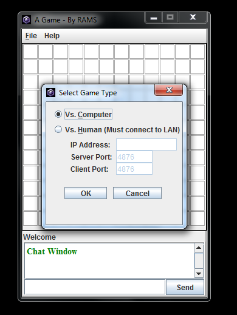
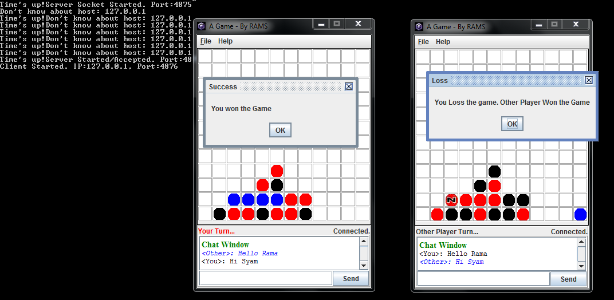

#  Advanced tic-tac-toe Like Game

Developed at my B.Tech. graduation time for fun.

* **Network based**
* **Multiplayer game**
* **Single player - With simple Computer AI**

## Rules

1. Player should start marking rows from bottom row.
1. Player cannot put his mark in the box until bottom box is filled by anyone.
1. The player who succeeds in placing 4 of their marks in a horizontal, vertical, or diagonal row wins the game.
